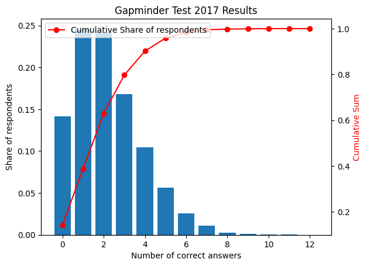
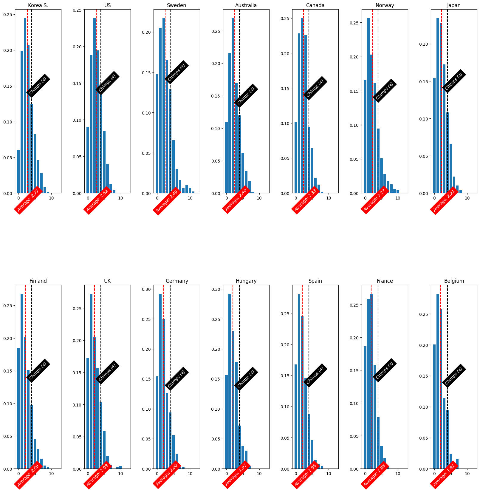
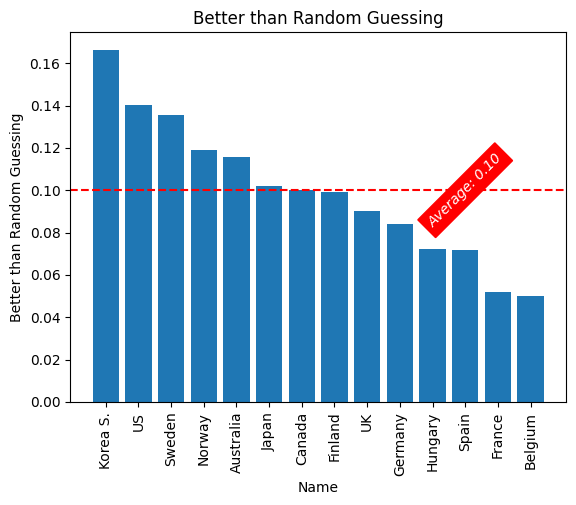
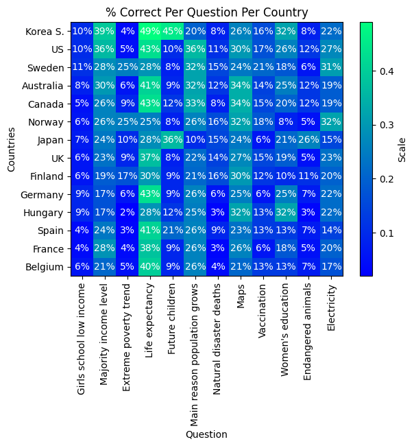
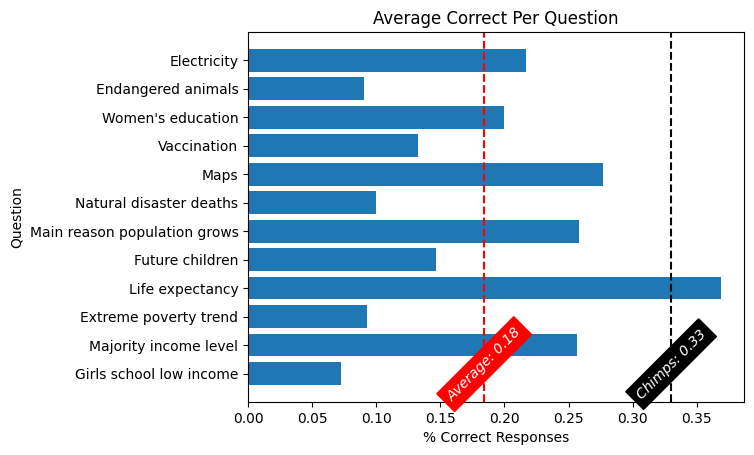

# Gapminder Test 2017

## 1) About the Test
Gapminder Test 2017 is a misconception study carried out by Gapminder. In the study, a total of 12000 people accross 14 different countries were asked 12 questions related to world statistics. Each question has 3 possible answers and only one is correct. What this study found is that nearly **80% of respondents did less than random guessing**!

Follow the link blow where you'll find 12 questions. I suggest going over them to see how you do. Later go to the [Results](#results) section to view some statistics on the results of this test. If you want direct access to the results datasets refer to the notebook [gapminderTest2017.ipynb](./gapminderTest2017.ipynb).
    :monkey: :monkey: :monkey: [Gapminder Test 2017](https://upgrader.gapminder.org/t/2017-gapminder-test/2) :monkey: :monkey: :monkey:

    <h2>Welcome to the Gapminder Test</h2>
    
This is a test of your knowledge of world statistics.

## 2) Results
### 2.1) Number of correct answers vs share of respondents

**Conclusion:** 
- Chimpanzees picking answers by random would score an average of 4 out of 12.
- People scored systematically worse than random: 2.2 correct answers, across all 14 countries.
- Only 10% scored better than random. And they scored only slightly better.
- We think this means: There are **strong widespread misconceptions about the state of the world**, which make it possible for monkeys to win over humans on fact questions.
- This chart shows the distribution of the 12000 people by their number of correct answers. A stunning 14% scored zero correct answers, and only 10% Scored better than random.
- But in general the pattern is clear. Only a fraction, between 5 and 15% scored better than random.
- That means that 90% of people would score better if they closed their eyes and didn't read the question.

### 2.2) Average number of correct answers
People answered on average **2.2 correct answers**, across all 14 countries. Note that this is below random guessing! If we randomly guessed then we would get an expected value of 4 correct answers.

### 2.3) Country Score Distributions
These graphs represent the number of correct answers vs share of respondents by country. They are ordered by average number of correct answers with South Korea leading the ranking and Belgium last. Note how in every single country, the average number of correct answers is below random guessing (4)! 

### 2.4) Better than Random Guessing
On average, each country had 10% of respondents that answered 5 or more questions correctly. That means that on average, **90% of people would score better if they closed their eyes and didn't read the question.**

### 2.5) Country Percent Per Question

Below is how each country responded to each question. The % is the amount of times that that country answered correctly over the total questions asked to that country.

Finally, the last chart shows the average % of correct responses per question. Note that if we were to choose randomly on a question that has one possible correct answer out of 3, then the odds of picking the right one is 1/3 = 0.33. In every case, except the Life expectancy question, humans underperformed a chimp doing random guessing on these questions.

**Conclusions:**
- Although far from a perfect score, people tend to be correct about some facts of the world. These are related to income levels, life expectancy, world population, and the distribution of population in the world.
- On some questions, all countries scored consistently low. The topics included: Girls education, extreme poverty trend, Natural disaster trends and vaccination.
- A single question stood out where the every country scored poorly except for Japan, South Korea and Spain, taking a near to 2x lead over the rest of the world. This question was related to the amount of future children: _There are 2 billion children in the world today, aged 0-14 years old. How many children will there be in the year 2100 according to the United Nations?_ Why could this be the case?

## 3) Where to go form here?
Go over to [Gapminder](http://gapminder.org/) web page to explore other surveys and datasets they have. I also highly recommend giving the book [Factfulness](https://www.amazon.com/Factfulness-Reasons-World-Things-Better/dp/1250123828/ref=asc_df_1250123828?mcid=c7e9c22f52e63f489984396dbe225ea2&hvocijid=4334139085112369359-1250123828-&hvexpln=73&tag=hyprod-20&linkCode=df0&hvadid=721245378154&hvpos=&hvnetw=g&hvrand=4334139085112369359&hvpone=&hvptwo=&hvqmt=&hvdev=c&hvdvcmdl=&hvlocint=&hvlocphy=9007284&hvtargid=pla-2281435176458&psc=1) a read since it digs deeper into why these misconceptions occur and how we can trick our mind in order to not fall into them.
